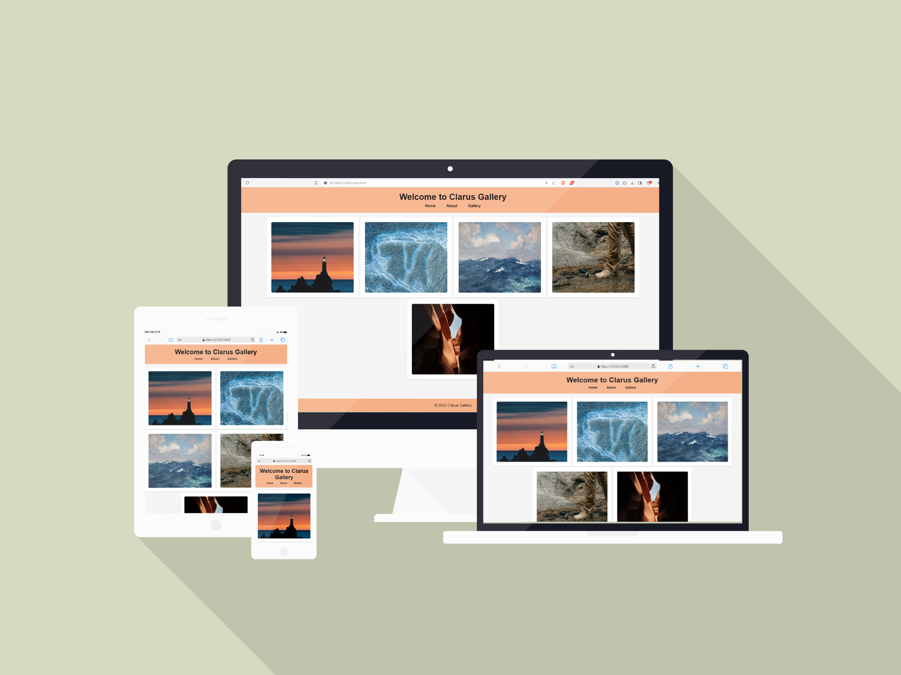

## Project Title: Clarus Gallery HTML/CSS Design

### Description:

The Clarus Gallery project is a website designed to allow users to explore various art collections and exhibitions. This project incorporates important CSS features such as "flex," "position," "margin," and "padding." The primary goal is to create an attractive, user-friendly, and responsive web interface that enables users to seamlessly discover art collections, exhibitions, and related content.

### Expected Outcome:

 

### Demo

[Clarus Gallery](https://anthonyins.github.io/ass-flex/)

### Note

- Please remember to customize the images and texts according to your preferences.
